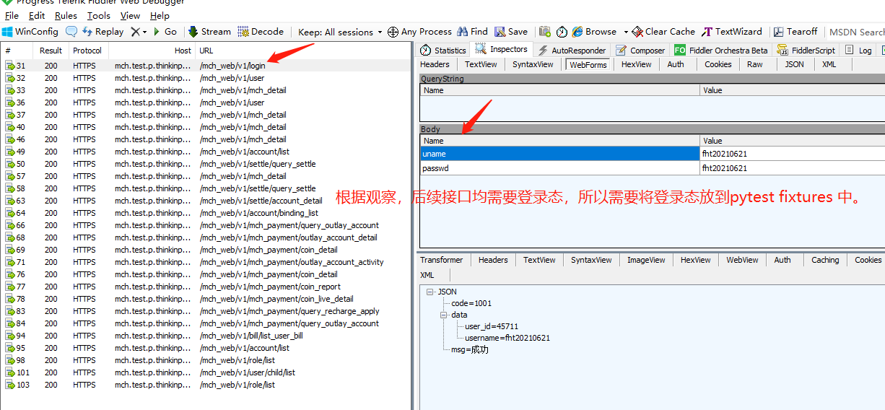
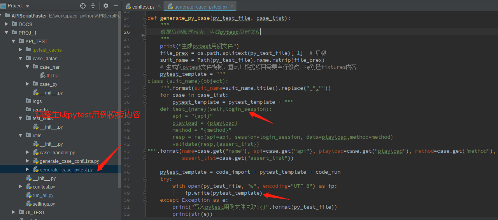

# APIScriptFaster
快速构建api脚本自动化DEMO


## 项目背景
当我们需要对一个前端项目进行接口自动化回归测试时，无论是写接口脚本还是使用postman，jmeter或者是使用一些自动化平台，都需要做大量的接口配置工作。

为了减少测试人员代码编写或接口配置工作，基于pytest脚本模板，编写了本项目，目的的实现：

1. 直接通过抓包文件HAR生成可执行的pytest用例文件。
2. 可充分利用pytest的特性，可灵活编写代码，类似插件一样插入到pytest用例代码中。

## 项目目录结构
```
E:.
│  README.md
│  requirements.txt
│
└─PROJ_1
    ├─API_TEST
    │  │  conftest.py
    │  │  run_all.py    # 运行主程序
    │  │  settings.py   
    │  ├─case_datas
    │  │  │
    │  │  ├─case_har     # 将Fiddler中导出的xx.har文件放到这里
    │  │  │  index.har
    │  │  │
    │  │  ├─case_py     # 运行generate_case_confLists.py 脚本将xx.har解析成用例配置列表xx.py
    │  │     index.py
    │  ├─logs
    │  │     runtime_2021-06-21_19-49-44_984966.log
    │  ├─reports
    │  │     API_Report.html
    │  ├─test_suits     # 运行 generate_case_pytest.py 脚本将xx.py 解析生成pytest用例文件test_xx.py
    │  │     test_index.py
    │  ├─utils
    │  │     case_handler.py    # 请求，断言处理
    │  │     generate_case_confLists.py # 将HAR文件解析成用例配置列表
    │  │     generate_case_pytest.py    # 将用例配置列表解析成pytest运行文件
```

## 自动化过程分解

1. [x] **step1：通过Fiddler等工具，导出接口HAR文件xxx.har**；
* 备注：建议使用Fiddler，可设置过滤器，方便过滤和删除不必要的接口
2. [x] **step2：通过脚本解析HAR文件，生成测试用例配置列表** ；
* 备注：举例如将index.har文件存到项目case_datas/case_har/目录下，然后修改`generate_case_confLists.py`中的har文件路径.
运行后会生成用例配置文件case_datas/case_py/xxx.py,内容类似如下：
```python
case_list=[
    {
        "name": "mch_web_v1_login",
        "method": "POST",
        "api": "/mch_web/v1/login",
        "playload": {
            "uname": "fht20210621",
            "passwd": "fht20210621"
        },
        "assert_list": [
            [
                "resp.status_code==200",
                "接口响应状态码不等于200"
            ]
        ]
    },
    ...
    ]
```

* 备注：通过修改配置，可实现python代码参数化，变量自定义等功能

3. [x] **step3：通过脚本解析步骤2中生成的测试用例列表，生成可执行的pytest用例脚本**；
* 备注：修改`generate_case_pytest.py`中的case_list和py_test_file，运行后会生成pytest用例文件如test_suits/test_xxx.py
内容类似如下：
```python
from PROJ_1.API_TEST.utils.case_handler import *

class TestIndex(object):
    
    def test_mch_web_v1_login(self,login_session):
        api = "/mch_web/v1/login"
        playload = {'uname': 'fht20210621', 'passwd': 'fht20210621'}
        method = "POST"
        resp = req(api=api, session=login_session, data=playload,method=method)
        validate(resp,[['resp.status_code==200', '接口响应状态码不等于200']])
    ...
```
4. [x] **step4：运行pytest用例脚本，生成测试报告**。

## DEMO 实例过程







